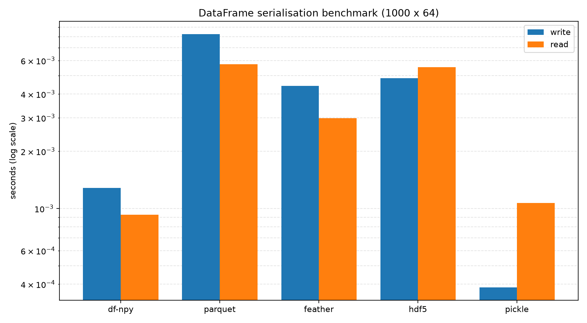

# df-npy

Serialize and deserialize pandas DataFrames to `.npy` plus JSON metadata.

## Why

`df-npy` wraps `np.save` / `np.load` to provide a secure, portable serialization format
for pandas DataFrames. Its main practical advantage is **concurrent columnar subsetting**:
because the on-disk layout is a plain Fortran-order NumPy array, loading a 50 % column
subset from many files in parallel only faults in the pages for those columns. Formats
that must deserialise an opaque byte stream (pickle) or decode every row-group
regardless of column selection (parquet at small sizes) carry extra overhead in this
pattern.

The benefit is size-dependent. At ~1 MB per file the formats are within noise of each
other. The gap opens above ~5–10 MB per file and becomes clearly measurable at 50–100 MB
(roughly 1.5–1.7× faster wall-time than pickle in an 8-worker concurrent subset read).
For single-file sequential reads where all columns are needed, pickle is typically faster
because it streams the file in one pass rather than page-faulting through a memory map.

E.g.


## Security

### Pickle policy

`df-npy` has a strict no-pickle policy.

- Serialization always writes NumPy arrays with `allow_pickle=False`.
- Deserialization always reads with `allow_pickle=False`.
- DataFrames that would require pickle-backed object serialization are rejected.

This behavior is intentional for security-sensitive environments.

### What this means in practice

Supported data should be representable without Python object pickling.

Examples of unsupported frames:

- Object/string frames containing non-string Python objects.
- Heterogeneous object columns that rely on pickle to round-trip values.

When unsupported data is provided, `df-npy` raises `ValueError` rather than falling back to pickle.

## API

Public API:

- `NpySerializer.to_npy(df, file_path)`
- `NpySerializer.from_npy(file_path, identifiers=None)`

Import:

```python
from df_npy import NpySerializer
```

## Benchmark

<!-- BENCHMARK_RESULTS_START -->
### Serialisation benchmark

- Generated by scripts/benchmark_serialisation.py.
- Dataset shape: 50000 x 64, repeats=10, seed=42.
- Cache policy between timed write/read ops: posix_fadvise(POSIX_FADV_DONTNEED) (best-effort advisory; does not guarantee cold cache).
- Note: Write times have high variance due to filesystem I/O variability. Treat as approximate/directional, not precise benchmarks.
- Generated at: 2026-07-05 17:28:04Z.

| Format | Write (median) | Read (median) | Write vs df-npy | Read vs df-npy | Notes |
|---|---:|---:|---:|---:|---|
| df-npy | 0.0075s | 0.0008s | 1.00x | 1.00x |  |
| parquet | 0.2634s | 0.0320s | 35.33x | 42.09x |  |
| feather | 0.0204s | 0.0240s | 2.73x | 31.50x |  |
| hdf5 | 0.0266s | 0.0664s | 3.56x | 87.19x |  |
| pickle | 0.0078s | 0.0177s | 1.05x | 23.23x |  |


<!-- BENCHMARK_RESULTS_END -->
